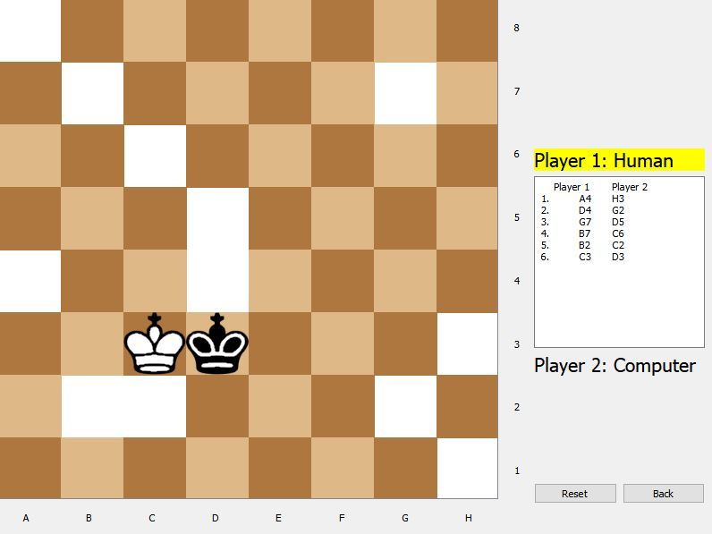
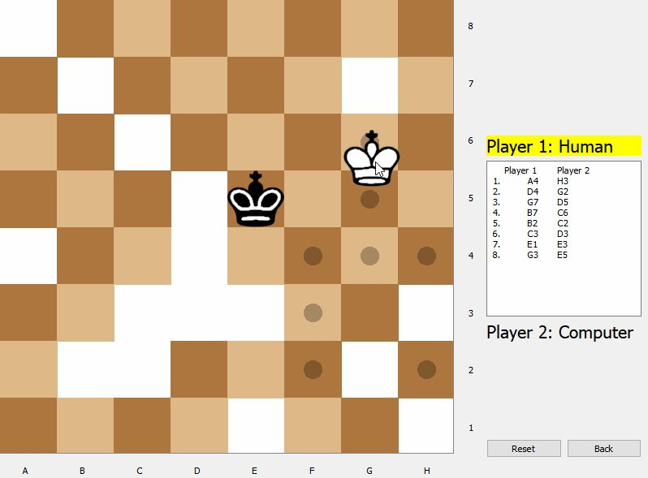
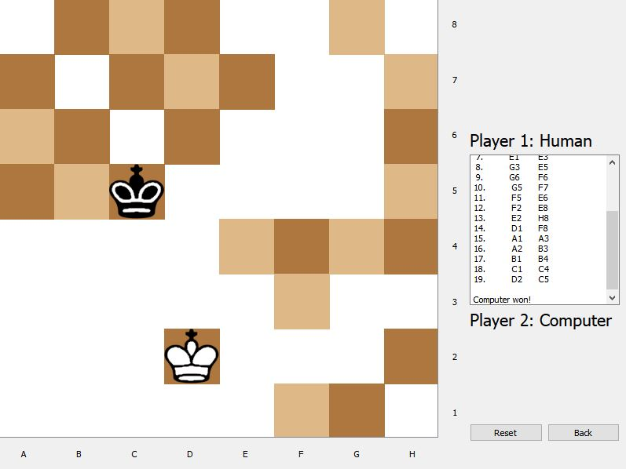

# Isolation Game

Two players on an 8x8 board, each player can move like a queen in chess, spaces that each player moves to become occupied and become a sort of barrier, goal is to isolate your opponent to the point that they have no more available moves.

## Authors

UI by [Andrew Sison](https://github.com/asison19)

AI by [Joel Tengco](https://clovenski.github.io/resume/)

## Qt License

This application was developed using the open source version of [Qt Creator](https://www.qt.io/). As such, this version of Qt Creator is licensed under the LGPLv3 license, which can be viewed in [Qt-License.txt](Qt-License.txt). The source code of Qt can be found [here](https://github.com/clovenski/isolation-game/releases/tag/v1.0.0): `qtbase-5.12.3.tar.gz` or `qtbase-5.12.3.zip`.

## Usage

Get the latest release of this application [here](https://github.com/clovenski/isolation-game/releases). Download `isolation-game.zip`, unzip it and launch the game with `isolation.exe` in the unzipped directory. Choose the difficulty and who goes first, click *Start Game* and good luck!

## Examples

